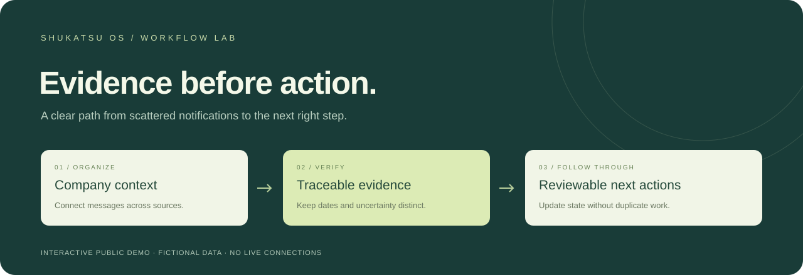

<p align="center"></p>

# Shukatsu OS — public showcase

**An AI-assisted job-search workflow connecting company research, past selection experiences, ES revision, interview preparation, and next actions.**

[日本語](README.ja.md) · [中文使用说明](README.zh-CN.md) · [Case study: English](docs/case-study.en.md) · [日本語](docs/case-study.ja.md) · [Evaluation](docs/evaluation.md)

Company → project → deadlines, mail, ES, source-linked research, interview practice and Calendar. Four fictional companies, seven independent projects and a fully local preparation workspace.

This standalone project uses **entirely fictional data**. It contains no applicant profile, private mail, production database, credentials, account links or production history. It is an AI-assisted implementation and a product/workflow design showcase.

## From research to action

Search accessible official and experience sources → organize seven-dimension company/industry research → distill past ES and interview lessons → review and revise an ES against confirmed experience → prepare for interviews → manage project deadlines and actions.

The full working environment combines companion agent skills with a private ledger. This standalone public website demonstrates their information flow with fictional data.

[Full feature map: English](docs/features.en.md) · [全機能：日本語](docs/features.ja.md)

## Product ownership

I owned requirements, information design, acceptance review, and prioritization. I chose company → opening → event organization and rules that distinguish invitations from confirmed bookings; code was generated with AI coding tools.


## Try it in six minutes

Open the [interactive guide](https://yaenyanyako.github.io/shukatsu-os-showcase/#guide), or serve this folder with `python3 -m http.server 8876 --bind 127.0.0.1` and open `http://127.0.0.1:8876/` in a standalone browser. Embedded local-file previews may block navigation. No account, dependency installation or API key is needed.

1. Process the twelve notices; inspect company/project attribution and source evidence.
2. Add three fictional ES versions to an untouched Aster project. Open **資料・版**: research and ES are separate, confirmed v2 stays first while later draft v3 is folded. Download a fictional CV PDF.
3. Collect/distill authored research, edit an ES, save a version and explicitly confirm it. Confirmation does not submit anything.
4. Check preparation timing: the internship waits; a screening AI invitation opens practice while retaining screening status. A separate Kumo screening-pass example does not book an interview.
5. In **未完了の確認**, apply a fictional ES receipt. The test stays pending; old, undated and saved items remain visible. Only an explicit activity reply creates a journal note.
6. Simulate Calendar synchronization/rescheduling, download fictional ICS, replay processing and reload state. Follow the [full walkthrough](docs/demo-guide.md).

The reset button clears this browser's demo state. All scenario dates are fictional May 2030 JST, not real opportunities or reminders. [Version 2.1 changes](CHANGELOG.md).

## What is real, simulated, or absent?

| Component | Status |
|---|---|
| Grouping, date validation, state projection, deduplication, overlap detection | Executable deterministic JavaScript |
| Documents, ES confirmation/history, answers, receipts and pending review | Executable local editing, deterministic rules and persistence; content is authored fiction |
| Company/project research, source collection and distillation | Fictional catalog, source-linked saving and replay-safe collection simulation |
| Calendar connection / PDF and ICS | Local sync simulation; executable fictional PDF/ICS generation and downloads |
| Source messages and extracted facts | Hand-authored fictional fixtures |
| AI inference and extraction | Not connected; structured fixtures stand in for this stage |
| Email, recruitment portals, calendar services, submissions | Not connected; no external actions |

Seven independently identified projects illustrate multiple opportunities per company. No current selection-company names or private operating volumes are published. The case study explains design decisions using only the fictional demo dataset.

## Product decisions

- **Project isolation:** deadlines, ES and interview answers belong to a specific course; company-wide notices remain unassigned to a project.
- **Research provenance:** fictional provider, year, round and project remain attached to distilled lessons.
- **Company context:** a platform-sent message can belong to a known company; a multi-company digest cannot be assigned arbitrarily.
- **Evidence before state:** an invitation does not create a confirmed reservation. A confirmation supersedes an RSVP action.
- **Date semantics:** reply/submission deadline, event time and cancellation cutoff have separate fields.
- **Honest uncertainty:** company-less notices become review items. Missing dates remain missing.
- **Incremental processing:** source IDs are retained; reprocessing is idempotent. A new rescheduling notice updates the event and recomputes conflicts.

## Structure

```text
index.html             Application entry point
src/fixtures.js        Fictional source messages and structured facts
src/workflow.js        Pure validation, projection and transition rules
src/catalog.js         Fictional projects, research sources and question banks
src/preparation.js     ES, distillation, interview and Calendar state / ICS
src/records.js         Authored materials, stage evidence, receipts and daily-review rules
src/record_views.js    Material/version, reconciliation and walkthrough views
src/workbench.js       Company and project preparation views
src/app.js             Browser UI, routing and local state
assets/                Local styling and original SVG illustrations
tests/                 Node behavioral and UI-controller tests
docs/                  Case study, architecture, evaluation and demo guide
scripts/               Public-file checks and release packaging
```

## Verify

Requires Node.js 18+ and Python 3.9+. No package installation is needed.

```bash
npm test
python3 scripts/check_public.py
```

The tests check deterministic workflow behavior. They do **not** measure an AI model. See [evaluation scope and limitations](docs/evaluation.md).

## Put it on GitHub Pages

Upload the **contents** of this directory to the root of a new repository. Keep the folder structure. Do not upload a private project alongside it.

In the repository, select **Settings → Pages → Deploy from a branch → your default branch → /(root) → Save**. This site has no build step. `.nojekyll` is included. GitHub's [publishing-source guide](https://docs.github.com/en/pages/getting-started-with-github-pages/configuring-a-publishing-source-for-your-github-pages-site) describes this setup.

To make a clean release archive:

```bash
python3 scripts/package_release.py ../shukatsu-os-showcase.zip
```

Only files in `release-files.json` are packaged. Packaging fails on an unexpected file, a symlink or a privacy-check finding. No Git history is included.

## Privacy and authorship

Read [PUBLIC_DATA.md](PUBLIC_DATA.md). All examples were authored for this demo, rather than exported and renamed from personal records. OpenWork, BizCampus, 外資就活 and ONE CAREER names represent source categories; their actual posts are not reproduced. Browser-entered drafts are not packaged into the static files. Source and documentation were developed with AI assistance; the repository makes no claim that every line was independently hand-written. Proposed evaluations and future integrations are explicitly separated from implemented behavior.

MIT License. The cover image is an original conceptual illustration, not a screenshot or a production-performance chart.
