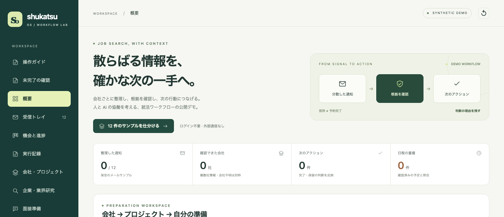

# Shukatsu OS — 散らばる通知から、根拠つきで次の一手へ

就活の通知を会社・募集ごとに整理し、根拠を確認して「次にやること」を選ぶワークフローのデモです。データはすべて架空です。

**▶ [公開デモを開く](https://yaenyanyako.github.io/shukatsu-os-showcase/)**（ログイン不要・外部サービス接続なし・操作ガイドは約6分）

- ケーススタディ：[日本語](docs/case-study.ja.md) · [English](docs/case-study.en.md)
- 私の役割：要件定義・情報設計・受け入れ確認・改善の優先順位付け。コードはAIコーディングツールで生成しています。

[English](README.en.md) · [中文](README.zh-CN.md)

## 実際に動く操作と、架空例の境界

| 項目 | このデモでできること・境界 |
|---|---|
| 通知の整理・根拠確認 | JavaScriptで会社・募集への振り分け、日付検証、状態更新、重複排除を実行 |
| 資料・ESの版管理・未完了の確認 | 編集、保存、確認版の選択、過去版の表示、該当作業の完了更新をブラウザ内で実行 |
| 通知本文・企業情報・抽出結果 | 手作業で作った架空例。実メール取得やAIによる抽出は未接続 |
| 企業研究の収集・整理 | 架空の資料IDと出所を保存する模擬操作。外部検索や投稿の取得はしない |
| 面接準備 | 明示的な架空の案内や書類通過の根拠に応じて練習を表示。助言は簡易ルールと固定文 |
| Calendar・PDF・ICS | Calendar接続は模擬同期。架空のPDF・ICS生成とダウンロードは実行可能 |
| メール・採用サイト・外部カレンダー | 未接続。応募、予約、送信、外部サービスへの書き込みは行わない |

## 最初に試すこと

「12 件のサンプルを仕分ける」→ 根拠の通知を読む → 募集ごとの次の行動を確認する。
同じ通知で再実行すると、タスクや予定が増えないことも確認できます。[順番に試す操作ガイド](https://yaenyanyako.github.io/shukatsu-os-showcase/#guide)

ほかに：企業研究の整理、ESの版管理、面接準備、カレンダー連携（模擬）。詳細は[機能一覧](docs/features.ja.md)へ。

## 資料と公開範囲

[検証範囲](docs/evaluation.md) · [今回の更新](CHANGELOG.md) · [公開データの扱い](PUBLIC_DATA.md) · [開発者・保守担当向け](docs/maintainer.md)

実際の応募者のプロフィール、選考中の企業、書類、メール、アカウント、私用台帳の件数は公開しません。例は私用記録の置換ではなく、このデモのために新しく作ったものです。入力はこのブラウザ内だけに保存され、リセットで消せます。AI精度、時間削減や採用成果は測定していません。

MIT License.
